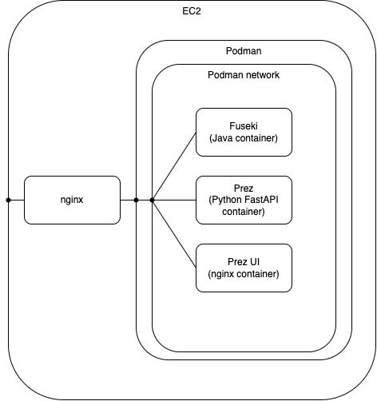

# British Geological Survey Ansible Prez Stack

An Ansible playbook and roles to manage Debian cloud VMs running the Prez Stack.

Note: This playbook has been tested on Debian 12.

The Prez Stack consists of the following:

- Apache Jena Fuseki (database)
- Prez (backend web API)
- Prez UI (web server serving static web assets for the Prez UI)
- Nginx (web server - ingress proxy to the stack)

The different components of the Prez Stack run inside containers managed by Podman. The containers themselves are not managed directly with Podman but instead are managed via systemctl. Example, to restart the Fuseki container, run `sudo systemctl restart container-fuseki`. However, manual actions such as these shouldn't be required and instead, they should be actioned through a role within the `prez.yml` playbook.

Fuseki, Prez and Prez UI all run inside their own containers and they are accessed through an nginx server running on the target machine.



## Before starting

This playbook assumes a cloud VM with SSH access has been set up. If you are using [AWS](https://aws.amazon.com), it would be an [EC2](https://aws.amazon.com/pm/ec2/) instance.

Ensure a DNS record has been set to point to the IP of the VM and update the domain name information in the [`hosts`](hosts) file and in [`group_vars/letsencrypt.yml`](group_vars/letsencrypt.yml) and [`group_vars/nginx.yml`](group_vars/nginx.yml). These values are used to target the VM machine, setup nginx configuration and also SSL certificate registration with [Let's Encrypt](https://letsencrypt.org).

## Ansible environment

Ansible version 2.14 and Python 3.9 - 3.11 is required.

### Create a Python virtual environment and use it.

```bash
python -m venv venv
source venv/bin/activate
```

### Install the Python dependencies.

```bash
pip install -r requirements.txt
```

The Ansible [`hosts`](hosts) file with a section named `webservers` manages the target machines these plays apply to.

## Ansible playbooks

### Viewing/editing Ansible Vault file

The file [`vault.yml`](group_vars/vault.yml) is encrypted using Ansible Vault. To view or edit the file, run the following.

Note: obtain the password from the system system administrator and create a file [`./ansiblepass`](./ansiblepass) before proceeding.

To edit the vault file, run the following.

```bash
ansible-vault edit group_vars/vault.yml --vault-password-file ./ansiblepass
```

These are the variables in the vault.

```yml
vault:
  server:
    # remote server's user, e.g., ec2-user, ubuntu, admin
    user:

  letsencrypt:
    # contact email
    email:

  # Fuseki basic auth credentials
  fuseki:
    username:
    password:

  # Google Maps API key used by Prez UI
  prez-ui:
    google_maps_api_key:
```

### Running Ansible Roles

Run the roles in sequence for a fresh installation. The plays target the servers defined in [`hosts`](hosts) with the `remote_server_user` defined in [group_vars/vault.yml](group_vars/vault.yml).

#### Install nginx, certbot and setup letsencrypt

Variables:

- [`group_vars/nginx.yml`](group_vars/nginx.yml)
- [`group_vars/letsencrypt.yml`](group_vars/letsencrypt.yml)

```bash
ansible-playbook -i hosts --vault-password-file ./ansiblepass prez.yml -t nginx.install
```

#### Install podman

```bash
ansible-playbook -i hosts --vault-password-file ./ansiblepass prez.yml -t podman.install
```

#### Enable swap file

Variables:

- [`group_vars/swapfile.yml`](group_vars/swapfile.yml)

```bash
ansible-playbook -i hosts --vault-password-file ./ansiblepass prez.yml -t swapfile.enable
```

#### Install Apache Jena Fuseki

Variables:

- [`group_vars/nginx.yml`](group_vars/nginx.yml)
- [`group_vars/fuseki.yml`](group_vars/fuseki.yml)

Fuseki's exposure to the public internet via nginx is controlled by the `nginx.expose_fuseki` boolean variable.

Fuseki's basic authentication details such as username and password can be changed by editing group_vars/vault.yml.

```bash
ansible-playbook -i hosts --vault-password-file ./ansiblepass prez.yml -t fuseki.install
```

#### Setup the Fuseki data loader container

This container will provide an environment with the required dependencies to create and load Fuseki dataset data.

```bash
ansible-playbook -i hosts --vault-password-file ./ansiblepass prez.yml -t fuseki.data.setup
```

#### Create Fuseki dataset

```bash
ansible-playbook -i hosts --vault-password-file ./ansiblepass prez.yml -t fuseki.data.create
```

#### Configure Fuseki dataset

```bash
ansible-playbook -i hosts --vault-password-file ./ansiblepass prez.yml -t fuseki.data.configure
```

#### Install Prez

Variables:

- [`group_vars/container_image.yml`](group_vars/container_image.yml)

```bash
ansible-playbook -i hosts --vault-password-file ./ansiblepass prez.yml -t prez.install
```

#### Install Prez UI

Variables:

- [`group_vars/prez_ui.yml`](group_vars/prez_ui.yml)
- [`group_vars/container_image.yml`](group_vars/container_image.yml)

```bash
ansible-playbook -i hosts --vault-password-file ./ansiblepass prez.yml -t prez-ui.install
```

### Data Loading

#### Data

Once Fuseki is up and running, upload data using the [`kurra`](https://github.com/Kurrawong/kurrawong-python) CLI.

Upload data files:

```bash
kurra fuseki upload <file-or-directory> https://bgs.dev.kurrawong.ai/fuseki/bgs -u $FUSEKI_USERNAME -p $FUSEKI_PASSWORD
```

#### Labels

Prez will display labels for things identified with IRIs. To ensure all resources have labels, use the [`labelify`](https://github.com/Kurrawong/labelify) tool.

Firstly, compound all the data into one file using this [script](https://github.com/BritishGeologicalSurvey/vocabularies/pull/2/files#diff-e1558e54c56a937cbb5b365a3964ffc99be8bc423010620d650f892fd0db025a).

```bash
python compound.py
```

This will produce a `compounded.ttl` file.

Run the `labelify` tool.

```bash
labelify compounded.ttl -l "https://schema.org/name,http://www.w3.org/2004/02/skos/core#prefLabel,http://www.w3.org/2000/01/rdf-schema#label" > labels.txt
```
